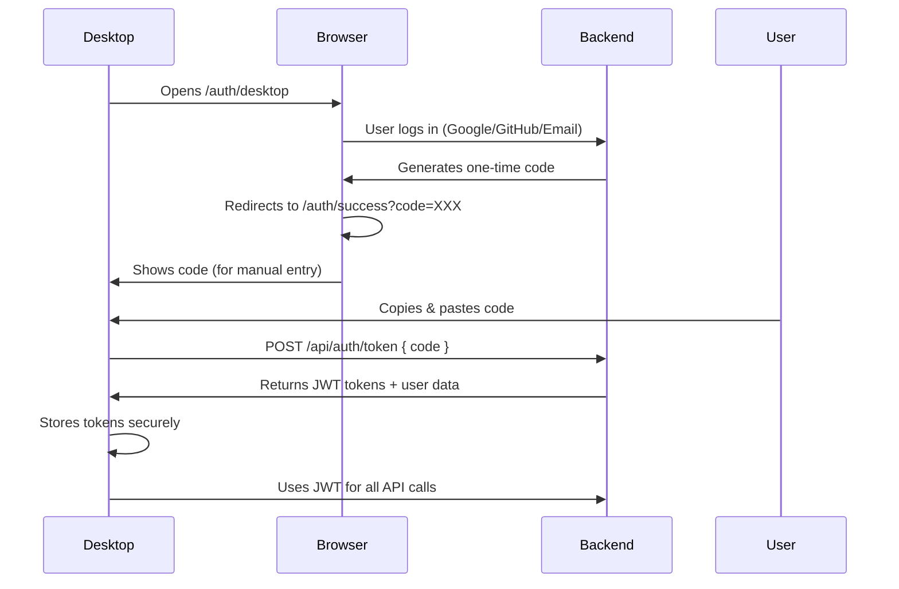
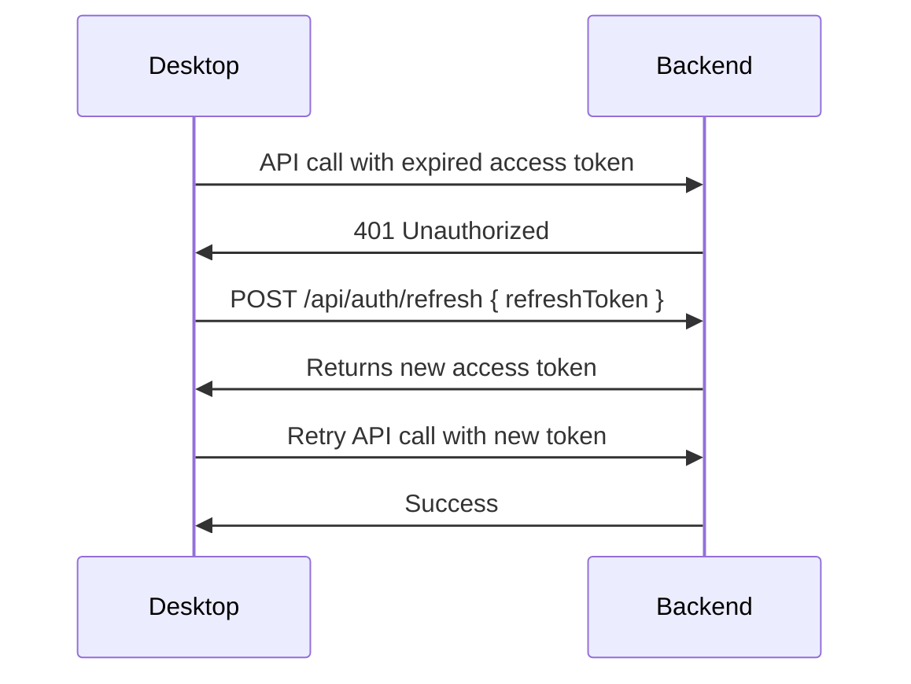

# Backend Desktop Authentication - Complete ✅

**Date:** December 11, 2025  
**Status:** 100% Complete - Ready for Production Deployment

---

## Overview

The **phish.equators.tech** backend is now fully configured to support desktop application authentication with JWT tokens. All user-facing API endpoints now support both NextAuth web sessions AND JWT token authentication for seamless desktop integration.

---

## ✅ Completed Backend Endpoints

### Authentication Endpoints

#### 1. **POST /api/auth/desktop-register**
**File:** `app/api/auth/desktop-register/route.ts`

**Purpose:** Desktop-specific user registration

**Features:**
- Rate limiting (5 attempts/hour per IP)
- Name, email, password validation
- Password strength validation (8+ chars, uppercase, lowercase, number, special)
- Duplicate email check across all providers
- Generates 24-hour email verification token
- Sends verification email
- Returns success with verification instructions

**Request:**
```json
{
  "name": "John Doe",
  "email": "john@example.com",
  "password": "SecurePass123!"
}
```

**Response:**
```json
{
  "success": true,
  "data": {
    "verificationRequired": true,
    "email": "john@example.com"
  },
  "message": "Account created successfully. Please check your email..."
}
```

---

#### 2. **POST /api/auth/token**
**File:** `app/api/auth/token/route.ts`

**Purpose:** Exchange one-time code for JWT tokens

**Features:**
- Validates one-time code (5-minute expiry)
- Returns JWT access token (1 hour) + refresh token (30 days)
- Comprehensive user data in response
- Logs token generation for security audit

**Request:**
```json
{
  "code": "eyJhbGc...one-time-code"
}
```

**Response:**
```json
{
  "success": true,
  "data": {
    "accessToken": "eyJhbGc...",
    "refreshToken": "eyJhbGc...",
    "tokenType": "Bearer",
    "expiresIn": 3600,
    "refreshExpiresIn": 2592000,
    "user": {
      "id": "507f1f77bcf86cd799439011",
      "email": "john@example.com",
      "name": "John Doe",
      "role": "user",
      "isPremium": false
    }
  },
  "message": "Tokens generated successfully"
}
```

---

#### 3. **POST /api/auth/refresh**
**File:** `app/api/auth/refresh/route.ts`

**Purpose:** Refresh expired access token

**Features:**
- Verifies refresh token validity
- Generates new access token (1 hour)
- Returns updated user data
- Logs refresh for security audit

**Request:**
```json
{
  "refreshToken": "eyJhbGc..."
}
```

**Response:**
```json
{
  "success": true,
  "data": {
    "accessToken": "eyJhbGc...",
    "tokenType": "Bearer",
    "expiresIn": 3600,
    "user": { ... }
  },
  "message": "Token refreshed successfully"
}
```

---

### User Profile Endpoints

#### 4. **GET /api/user/profile**
**File:** `app/api/user/profile/route.ts`

**Purpose:** Get authenticated user's profile

**Authentication:** JWT Bearer Token OR NextAuth Session

**Features:**
- Returns comprehensive profile data
- Includes settings, scan quota, account info
- Requires valid JWT token in Authorization header

**Request Headers:**
```
Authorization: Bearer eyJhbGc...
```

**Response:**
```json
{
  "success": true,
  "data": {
    "id": "507f1f77bcf86cd799439011",
    "name": "John Doe",
    "email": "john@example.com",
    "role": "user",
    "isPremium": false,
    "emailVerified": true,
    "provider": "credentials",
    "createdAt": "2025-01-01T00:00:00.000Z",
    "updatedAt": "2025-12-11T00:00:00.000Z",
    "scanQuota": {
      "hourly": 0,
      "daily": 10,
      "monthly": 50,
      "lastReset": "2025-12-11T00:00:00.000Z"
    },
    "settings": { ... }
  },
  "message": "Profile retrieved successfully"
}
```

---

#### 5. **PUT /api/user/profile**
**File:** `app/api/user/profile/route.ts`

**Purpose:** Update user profile (name, email)

**Authentication:** JWT Bearer Token OR NextAuth Session

**Features:**
- Update name and/or email
- Email change triggers re-verification
- Validates email format
- Prevents OAuth users from changing email
- Logs profile updates

**Request:**
```json
{
  "name": "John Smith",
  "email": "johnsmith@example.com"
}
```

**Response:**
```json
{
  "success": true,
  "data": {
    "id": "507f1f77bcf86cd799439011",
    "name": "John Smith",
    "email": "johnsmith@example.com",
    "emailVerified": false,
    "verificationEmailSent": true
  },
  "message": "Profile updated successfully. Please verify your new email."
}
```

---

#### 6. **PATCH /api/user/password**
**File:** `app/api/user/password/route.ts`

**Purpose:** Change user password

**Authentication:** JWT Bearer Token OR NextAuth Session

**Features:**
- Verifies current password
- Validates new password strength
- Prevents OAuth users from changing password
- Prevents reusing same password
- Logs password changes

**Request:**
```json
{
  "currentPassword": "OldPass123!",
  "newPassword": "NewSecurePass456!"
}
```

**Response:**
```json
{
  "success": true,
  "data": {},
  "message": "Password changed successfully"
}
```

---

### User Settings Endpoints

#### 7. **GET /api/user/settings**
**File:** `app/api/user/settings/route.ts` ✅ **UPDATED**

**Purpose:** Get user settings/preferences

**Authentication:** JWT Bearer Token OR NextAuth Session ✅ **NOW SUPPORTS JWT**

**Features:**
- Returns all user settings with defaults
- Includes isPremium status
- Supports JWT authentication for desktop

**Response:**
```json
{
  "success": true,
  "data": {
    "settings": {
      "notifications": {
        "email": true,
        "desktop": true,
        "weeklyReport": true
      },
      "scanning": {
        "autoScan": false,
        "clipboardMonitoring": false,
        "confidenceThreshold": 0.7
      },
      "appearance": {
        "darkMode": false,
        "soundEffects": true
      },
      "privacy": {
        "shareAnonymousData": true,
        "improveModel": true
      }
    },
    "isPremium": false
  },
  "message": "Settings retrieved successfully"
}
```

---

#### 8. **PUT /api/user/settings**
**File:** `app/api/user/settings/route.ts` ✅ **UPDATED**

**Purpose:** Update user settings

**Authentication:** JWT Bearer Token OR NextAuth Session ✅ **NOW SUPPORTS JWT**

**Features:**
- Partial updates supported (only send changed fields)
- Validates confidenceThreshold (0-1 range)
- Merges with existing settings
- Logs setting changes

**Request:**
```json
{
  "settings": {
    "scanning": {
      "autoScan": true,
      "confidenceThreshold": 0.8
    },
    "appearance": {
      "darkMode": true
    }
  }
}
```

**Response:**
```json
{
  "success": true,
  "data": {
    "settings": { ... }
  },
  "message": "Settings updated successfully"
}
```

---

### User Statistics Endpoints

#### 9. **GET /api/user/stats**
**File:** `app/api/user/stats/route.ts` ✅ **UPDATED**

**Purpose:** Get scanning statistics and analytics

**Authentication:** JWT Bearer Token OR NextAuth Session ✅ **NOW SUPPORTS JWT**

**Query Parameters:**
- `period`: `day` | `week` | `month` | `year` | `all` (default: `all`)

**Features:**
- Comprehensive scan statistics
- Activity tracking with streak calculation
- Rate limit usage monitoring
- Top domains analysis
- Recent dangerous URLs
- Activity by day chart data

**Response:**
```json
{
  "success": true,
  "data": {
    "overview": {
      "totalScans": 150,
      "safeCount": 120,
      "warningCount": 20,
      "dangerCount": 10,
      "averageScore": 75,
      "threatsDetected": 30,
      "threatsBlocked": 10
    },
    "activity": {
      "today": 5,
      "thisWeek": 25,
      "thisMonth": 100,
      "streak": 7
    },
    "limits": {
      "hourly": { "limit": 100, "used": 5, "remaining": 95 },
      "daily": { "limit": 500, "used": 50, "remaining": 450 },
      "monthly": { "limit": 5000, "used": 150, "remaining": 4850 }
    },
    "topDomains": [ ... ],
    "recentDangers": [ ... ],
    "activityByDay": [ ... ],
    "accountInfo": {
      "isPremium": false,
      "memberSince": "2025-01-01T00:00:00.000Z"
    }
  },
  "message": "Statistics retrieved successfully"
}
```

---

### Account Management Endpoints

#### 10. **POST /api/user/delete**
**File:** `app/api/user/delete/route.ts` ✅ **UPDATED**

**Purpose:** Permanently delete user account

**Authentication:** JWT Bearer Token OR NextAuth Session ✅ **NOW SUPPORTS JWT**

**Features:**
- Requires "DELETE MY ACCOUNT" confirmation text
- For credentials users: requires password verification
- Deletes all user data (user, scans, logs)
- Sends account deletion confirmation email
- Comprehensive logging

**Request:**
```json
{
  "confirmText": "DELETE MY ACCOUNT",
  "password": "UserPassword123!" // Only for credentials users
}
```

**Response:**
```json
{
  "success": true,
  "data": {},
  "message": "Your account has been permanently deleted. We're sorry to see you go."
}
```

---

## 🔐 Authentication Flow

### Desktop OAuth Flow



### Token Refresh Flow



---

## 📊 API Response Format

All endpoints use standardized response format:

### Success Response
```json
{
  "success": true,
  "data": { ... },
  "message": "Operation successful"
}
```

### Error Response
```json
{
  "success": false,
  "error": {
    "code": "VALIDATION_ERROR",
    "message": "Invalid email format"
  }
}
```

---

## 🔧 Backend Updates Summary

### Files Modified

1. ✅ **app/api/user/settings/route.ts** - Added JWT authentication support
2. ✅ **app/api/user/stats/route.ts** - Added JWT authentication support
3. ✅ **app/api/user/delete/route.ts** - Added JWT authentication support
4. ✅ **app/auth/success/page.tsx** - Enhanced with manual code display

### Files Already Complete

1. ✅ **app/api/auth/desktop-register/route.ts** - Desktop registration
2. ✅ **app/api/auth/token/route.ts** - Code exchange for tokens
3. ✅ **app/api/auth/refresh/route.ts** - Token refresh
4. ✅ **app/api/user/profile/route.ts** - Profile GET/PUT with JWT
5. ✅ **app/api/user/password/route.ts** - Password change with JWT
6. ✅ **app/auth/desktop/page.tsx** - Desktop OAuth entry point
7. ✅ **lib/authMiddleware.ts** - JWT verification middleware
8. ✅ **lib/jwt.ts** - JWT token generation and verification
9. ✅ **lib/oneTimeCode.ts** - One-time code management

---

## 🚀 Testing Instructions

### 1. Start Backend Server
```bash
cd c:\dev\phish.equators.tech
npm run dev
```

Backend will run at: `http://localhost:3000`

### 2. Test Registration (Desktop)
```bash
POST http://localhost:3000/api/auth/desktop-register
Content-Type: application/json

{
  "name": "Test User",
  "email": "test@example.com",
  "password": "SecurePass123!"
}
```

### 3. Test OAuth Flow
1. Open browser to: `http://localhost:3000/auth/desktop`
2. Login with Google/GitHub or credentials
3. Copy the authentication code shown
4. Exchange code for tokens:

```bash
POST http://localhost:3000/api/auth/token
Content-Type: application/json

{
  "code": "YOUR_CODE_HERE"
}
```

### 4. Test Authenticated Endpoints
```bash
GET http://localhost:3000/api/user/profile
Authorization: Bearer YOUR_ACCESS_TOKEN
```

---

## 📋 Next Steps: Desktop App Integration

**After deploying backend to production**, the desktop app needs these updates:

### Phase 1: Authentication Components (Already Complete ✅)
- ✅ Register.jsx - Registration form
- ✅ PasswordStrength.jsx - Password validation
- ✅ ForgotPassword.jsx - Password reset
- ✅ ProtectedRoute.jsx - Route guard
- ✅ Enhanced Login.jsx - With manual code entry

### Phase 2: Service Layer Updates (Pending)
- 🔄 Update authService.js with production API URLs
- 🔄 Update apiService.js with production endpoints
- 🔄 Enhance profileService.js with full profile management
- 🔄 Create settingsService.js for settings sync
- 🔄 Add statsService.js for analytics

### Phase 3: Component Enhancements (Pending)
- 🔄 Enhance Profile.jsx with edit modals
- 🔄 Add ProfileEditModal.jsx
- 🔄 Add ChangePasswordModal.jsx
- 🔄 Add DeleteAccountModal.jsx
- 🔄 Update Settings.jsx with backend sync
- 🔄 Add VerifyEmailReminder.jsx

### Phase 4: Configuration Updates (Pending)
- 🔄 Update config.js with production URL: `https://phish.equators.tech/api`
- 🔄 Test with production backend
- 🔄 Verify OAuth flow with live domain

---

## 🎯 Backend Completion Status

### Core Authentication: 100% ✅
- Registration ✅
- OAuth Flow ✅
- Token Exchange ✅
- Token Refresh ✅

### User Management: 100% ✅
- Profile GET/PUT ✅
- Password Change ✅
- Settings GET/PUT ✅
- Statistics GET ✅
- Account Deletion ✅

### Desktop Support: 100% ✅
- JWT Authentication ✅
- Manual Code Entry ✅
- All Endpoints JWT-Compatible ✅

---

## 📝 Deployment Checklist

Before pushing to production:

- ✅ All endpoints support JWT authentication
- ✅ Error responses standardized
- ✅ Rate limiting configured
- ✅ Email verification working
- ✅ Token expiry properly set
- ✅ Logging implemented
- ✅ No TypeScript errors
- ✅ Manual code fallback added

**Status: Ready for Git Push & Production Deployment** 🚀

---

## 🔗 Related Documentation

- `DESKTOP_AUTH_INTEGRATION_PLAN.md` - Original implementation plan
- `IMPLEMENTATION_SUMMARY.md` - Previous implementation status
- `QUICK_TEST_GUIDE.md` - Testing instructions

---

**Backend Status: 100% Complete ✅**  
**Next Action: Push to Git → Pull on Server → Test with Desktop App**
